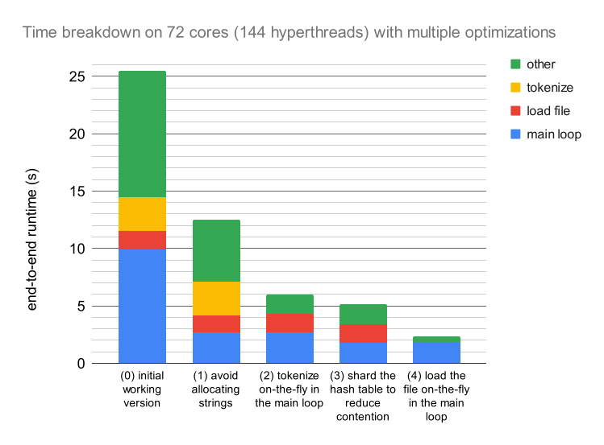

# mpl-1brc
Using
[MPL](https://github.com/MPLLang/mpl)
to solve the *1 Billion Row Challenge*
([site](https://www.morling.dev/blog/one-billion-row-challenge/),
[GitHub](https://github.com/gunnarmorling/1brc)).

To run it, you need [`smlpkg`](https://github.com/diku-dk/smlpkg) and [`mpl`](https://github.com/MPLLang/mpl) installed.

```
$ git clone https://github.com/shwestrick/mpl-1brc
$ cd mpl-1brc
$ smlpkg sync
$ make
$ ./main @mpl procs 8 -- data/1M.txt --verbose   # run on example data set of 1 million measurements
```

The above command uses an included `data/1M.txt` input file which has 1 million
measurements. **For the full competition, you need the 1 billion measurements
file**. See the
[1brc GitHub repo](https://github.com/gunnarmorling/1brc) for
instructions on how to generate it.

Contributions are welcome if anyone wants to help improve performance! Feel
free to submit PRs. See ideas for performance improvements below. (Not sure
about any of these, but it would be interesting to try them.)

## Current results

Here are my current results on 72 cores (144 hyperthreads).

With **bounds checking disabled**:
```
$ hyperfine --warmup 1 './main @mpl procs 144 set-affinity -- /usr3/data/1brc/measurements.txt --unsafe-no-bounds-checks'
Benchmark 1: ./main @mpl procs 144 set-affinity -- /usr3/data/1brc/measurements.txt --unsafe-no-bounds-checks
  Time (mean ± σ):      2.342 s ±  0.020 s    [User: 324.751 s, System: 2.546 s]
  Range (min … max):    2.317 s …  2.380 s    10 runs
```

And, with **bounds checking enabled**:
```
$ hyperfine --warmup 1 './main @mpl procs 144 set-affinity -- /usr3/data/1brc/measurements.txt'
Benchmark 1: ./main @mpl procs 144 set-affinity -- /usr3/data/1brc/measurements.txt
  Time (mean ± σ):      2.443 s ±  0.018 s    [User: 339.081 s, System: 2.687 s]
  Range (min … max):    2.417 s …  2.475 s    10 runs
```

These timings are not directly comparable with the timings reported in the
competition, because of differences in hardware. (E.g., I'm using a
much larger number of cores here.)

## Key optimizations

I ended up making four key optimizations to improve performance. In the end
this yielded a total improvement of approximately 10x over my initial working
implementation.



The key optimizations were:
  1. Don't allocate any intermediate strings. Instead, use file offsets as
  keys in the hash table, and compare keys by directly reading from the contents
  of the file. (commit: 7e0ae5ab970d56f4bcee1e246b7ef4360cdba601)
  2. Don't tokenize the file. Instead, parse entries on-the-fly in the main loop.
  (commit: fdf2f60676e09a67105800903860cf5782c205dc)
  3. Reduce contention in the hash table by sharding the values into multiple
  copies.
  (commit: 0c44a44b17dbe5aa550296e18784a042416dc903)
  4. Don't load the file into an array. Instead, operate directly on the mmap'ed
  file contents.
  (commits: 86ffcb2c1bfc5f4eff8dc23fe91046c19c3dab4a, 910875f3850bbcf46ca5c4e623407cafc9de6abc, 794a9d530672751d266c0ef9d1e89ed105ecc678)


## Potential improvements still TODO

- [x] Work directly on the mmap'ed file instead of loading it into an array first.
- [ ] Better hash function?
- [ ] Faster parsing? There are some cool ideas floating around in discussions of other 1brc solutions.
- [ ] Use block-local hash tables to avoid contention? 
- [x] Shard the hash table to avoid contention
- [x] Option for disabling bounds checks
- [ ] Store the components of the hash table values ("weights" in the code) in SoA style?
- [ ] Pack the min and max components of the weights into a smaller value? (These don't need nearly as many bits as we're using currently...)


At the moment, my guess is that better parsing and hashing would lead to
the biggest performance improvements. (We're getting great scalability, but
single-core performance is a little slow.)


~~I suspect also that avoiding
copying the whole file into an array would be a big win.~~ Done! Got a ~20% improvement.
